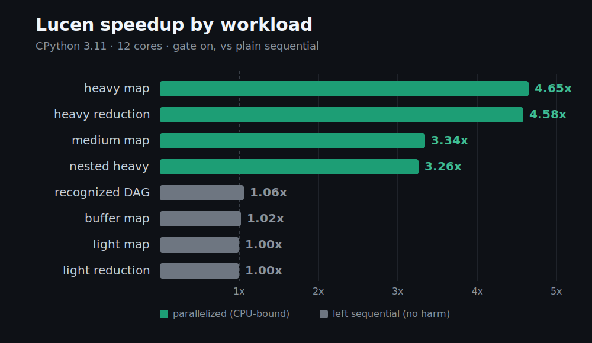

# Lucen

[](https://pypi.org/project/lucen/)
[](#supported-interpreters)
[](LICENSE)
[](tests/)

**Lucen is a source-to-source compiler and automatic loop parallelizer
for ordinary Python, driven by comment pragmas.** Unlike existing Python
parallel frameworks, it asks you to describe *where* parallelism is allowed
rather than *how* to implement it, and it parallelizes only the loops it can
prove are both safe and worthwhile. Its one guarantee has no tier and no
opt-out: **Lucen never produces an incorrect result.**


Before, ordinary Python:

```python
for i in range(len(records)):
    scores[i] = score(records[i])
```

After, still ordinary Python:

```python
# LUCEN START
for i in range(len(records)):
    scores[i] = score(records[i])
# LUCEN END
```

**3.8x faster** on 12 cores (CPython 3.14, CPU-bound map, [measured](BENCHMARK.md)).
**Bit-identical output**, floats included.
**No multiprocessing code.** No pools, no locks, no pickling errors to debug.
**No risk of adopting it**: a loop Lucen cannot prove safe runs exactly as
the sequential Python you wrote, and a structured report tells you why.

Activation is one call at program start:

```python
import lucen
lucen.activate()
```

The pragmas are ordinary comments. A file with Lucen removed, uninstalled,
deactivated, or never present runs identically to one where it never existed.
We call this the Comment Invariant, and it is load-bearing: the worst case of
adopting Lucen is the program you already had.

It covers the other case: the loop already sitting in a codebase that
nobody wants to restructure. No worker functions, no pool lifecycle, no
serialization plumbing, no rewrite into a framework's shape. Two comments
slide into existing code without a hiccup, and adoption is reversible by
deleting them.

---

**Contents:** [Guarantees](#the-three-guarantees) |
[Install](#installation) | [Tutorial](#tutorial-from-zero-to-first-speedup) |
[Beyond the basics](#beyond-the-basics) | [Expert guide](#expert-guide) |
[How it works](#how-it-works) | [Performance](#performance) |
[Limitations](#limitations) | [The honesty contract](#the-honesty-contract) |
[Documentation](#documentation) | [Contributing](#contributing) |
[License](#license)

---

## The three guarantees

1. **Never an incorrect result.** Chunks write private slabs, audited for
   disjointness at join and committed in chunk order. Dict insertion order,
   float reduction bits, and mid-error container state are identical to
   sequential execution, bit for bit. A write conflict discards the parallel
   attempt and transparently re-runs your loop sequentially.
2. **Never disruptive.** Anything Lucen cannot prove safe runs as the
   sequential Python you wrote, and the reason lands in a structured fallback
   report instead of your stderr. Exceptions keep their type, their message,
   and the exact sequential-prefix state of your containers.
3. **Never silently pointless.** A profitability gate (static pre-screen plus
   a runtime probe that does real work while measuring) refuses to
   parallelize loops that would lose to dispatch overhead, and reports that
   too. Parallelism you cannot observe is a bug here, not a shrug.

These are not aspirations. They are enforced by construction and verified by
a cross-version test matrix: 7 interpreters x 8 workloads x 4 execution
pathways, every cell bit-identical to plain Python. See
[BENCHMARK.md](BENCHMARK.md).

## Installation

```bash
pip install lucen
```

Python 3.9 or later. No required dependencies on 3.11+; on 3.9 and 3.10 the
TOML parser dependency (`tomli`) installs automatically.

From source (optional Rust acceleration core, needs a Rust toolchain):

```bash
git clone https://github.com/fcmv/lucen
cd lucen
pip install -e ".[dev]"
pytest
```

On GIL builds 3.9 through 3.14, `pip` installs a native core (Rust, abi3, one
binary per platform) that runs the orchestration hot loops (the write-set
audit and the by-reference reduction folds). On free-threaded builds, where
the abi3 core cannot load, `pip` installs a pure-Python wheel instead, so the
install always succeeds; Lucen then runs its pure-Python fallback, which is
fully supported and passes the identical test suite.

### Supported interpreters

| Interpreter | Status | Native core |
|---|---|---|
| CPython 3.9 to 3.14 (GIL) | Supported, tested per release | yes |
| CPython 3.13t / 3.14t (free-threaded) | Supported, tested | pure-Python fallback |
| PyPy 3.11 | Supported, tested on the fallback | pure-Python fallback |
| GraalPy | Best-effort, tested on the fallback | pure-Python fallback |

## Tutorial: from zero to first speedup

This walkthrough assumes nothing beyond basic Python. Every step shows real
commands and real output shapes.

### Step 1: install

```bash
pip install lucen
```

### Step 2: start with a program that is too slow

Save this as `work.py`. It scores 20,000 records with a CPU-heavy function,
plain Python, no Lucen anywhere yet:

```python
import math

def score(x):
    acc = 0.0
    for k in range(400):
        acc += math.sin(x * 0.001 + k) * math.cos(k * 0.5)
    return acc

def main():
    records = list(range(20_000))
    scores = [0.0] * len(records)
    for i in range(len(records)):
        scores[i] = score(records[i])
    print(f"checksum: {sum(scores):.6f}")

if __name__ == "__main__":
    main()
```

```bash
python work.py     # takes roughly a second of pure compute
```

### Step 3: mark the loop

Add two comment lines around the loop. Nothing else changes:

```python
    # LUCEN START
    for i in range(len(records)):
        scores[i] = score(records[i])
    # LUCEN END
```

Run it again. Nothing happens. That is the point: pragmas are comments, and
you have not activated anything. Your program is exactly as safe as before.

### Step 4: run it

Run the file with `lucen run`. It rewrites the marked loops in the script you
point at and then executes it, so the loop you just marked runs in parallel:

```bash
lucen run work.py
```

That is the whole story for a script you launch directly. When Lucen is instead
embedded in a larger application you start yourself, activate the import hook
once at startup. Activation installs the hook, so it must run before the module
holding your marked loop is imported, which is why that loop lives in an
imported module here:

```python
# app.py
import lucen
lucen.activate()

import work
work.main()
```

```bash
python app.py
```

On a multi-core machine the loop now runs about 3 to 4 times faster, and the
checksum is identical to the digit. Not approximately identical. Identical.

Two things to know, either way:

- The `if __name__ == "__main__":` guard in `work.py` matters on Windows and
  macOS. Lucen uses process workers there, and Python re-imports the entry
  module inside each worker. Lucen detects a missing guard and falls back
  to sequential with a message telling you to add it, so the failure mode is
  slowness, not breakage.
- `activate()` is idempotent and safe to call once at program start.

### Step 5: see what Lucen decided, without running anything

```bash
lucen explain work.py
```

```
work.py: 1 marked block(s) [gil interpreter assumed]

Block 1 (line 12)
  + Parallelized
  Backend: PROCESS (THREAD needs a free-threaded interpreter) (GIL interpreter assumed)
  Runtime-dependent (never reported statically): argument picklability,
  custom-callable well-formedness, pool availability -- see `lucen profile`.
```

`explain` is static and honest: facts are reported as facts, and anything
knowable only at call time is never reported as a yes or no.

### Step 6: understand a refusal

Change the loop body to depend on the previous element:

```python
    # LUCEN START
    for i in range(1, len(scores)):
        scores[i] = scores[i - 1] + score(records[i])
    # LUCEN END
```

```bash
lucen explain work.py
```

```
Block 1 (line 12)
  - Sequential
  Reason: cross-iteration dependency 'scores[i - 1]' (monotonic chain); ...
```

Your program still runs and still produces the correct answer. Lucen just
refuses to parallelize what it cannot prove, and says so. This is guarantee
number two working as designed.

### Step 7: understand "not worth it"

Mark a trivial loop:

```python
    # LUCEN START
    for i in range(len(xs)):
        ys[i] = xs[i] * 2 + 1
    # LUCEN END
```

At runtime Lucen probes the first chunk, measures roughly 50 nanoseconds
per iteration, computes that process dispatch would cost more than it saves,
and runs the whole thing sequentially at full speed. The fallback report
says:

```
lucen fallback: PARALLEL_UNPROFITABLE (work.py:12): measured ~50
ns/iteration loses to dispatch overhead; ran SEQUENTIAL (calibrate=false
overrides, spec 5.17)
```

If you believe the gate is wrong for your case, override it per block:

```python
# LUCEN START calibrate=false
```

### Step 8: read the fallback report programmatically

```python
import lucen
lucen.activate()

import work
work.main()

for record in lucen.get_fallback_report():
    print(record.error, record.file, record.line, record.message)
```

Nothing Lucen decides is hidden. Every downgrade has a reason string and a
location, and `lucen profile script.py` shows what actually ran, per
block, with timings.

That is the whole naive workflow: mark, activate, read what it tells you.
You never need to know what a slab or a wavefront is to get correct
parallelism.

## Beyond the basics

Tuning happens through pragma clauses. Every clause only ever trades a
Lucen-held proof for a user-held assertion, or exactness for speed, never
a different answer. A malformed clause is a loud import-time error with a
did-you-mean suggestion, never a silent ignore.

```python
# LUCEN START calibrate=false, timeout=5.0, on_error=collect
```

The full surface is fifteen clauses on `# LUCEN START` and two on
`# LUCEN TRUST`. The complete reference, with every accepted form, is
[docs/pragmas.md](docs/pragmas.md); the summary:

| Clause | What it does |
|---|---|
| `backend=` | Pin the backend: `thread`, `process`, `sequential`, with `pool_size`/`chunks` |
| `calibrate=` | Control the profitability gate (`false` forces parallel) |
| `grainsize=` | Level width for a recognized-DAG wavefront |
| `affinity=` | CPU affinity: `compact`, `scatter`, or `explicit(cores=[...])` |
| `nested=` | Policy for a block reached inside another parallel block |
| `depend=` | Assert independence (`none`) or an acyclic order (expert) |
| `skip_runtime_check=` | Disable the runtime write-set audit (expert, with `depend=none`) |
| `trust=` | Waive the purity or pickle check: `callables`, `pickle`, `all` |
| `reduce=` | Name the reduction op (`sum`, `min`, ...) or `custom(fn=, identity=)` |
| `reduction_order=` | `sequential_equivalent` (default, bit-identical), `stable`, or `custom` |
| `timeout=` | Bound wall time; raises `ParallelTimeoutError` |
| `on_error=` | Gather per-iteration exceptions instead of failing fast (`collect`) |
| `strict=` | Turn this block's fallbacks into hard errors (CI mode) |
| `on_fallback=` | Set how a fallback is surfaced for this block |
| `progress=` | Per-chunk or per-iteration progress reporting |

On `# LUCEN TRUST` above a helper `def`: `args=` (how its arguments are
trusted) and `qualname=` (which callable the trust applies to).

Project-wide defaults and hard ceilings live in `lucen.toml` at your
project root: pool sizes, timeout ceilings, an experimental-features veto,
error verbosity. Degenerate values are rejected at load with the same
strictness as pragma clauses.

CI integration: `lucen explain --strict --baseline baseline.json` fails
the build if any block's classification regressed relative to a committed
baseline, so a refactor that silently de-parallelizes a hot loop is caught in
review, not in production.

## Expert guide

The expert surface is the trust system. Lucen proves what it can and
trusts you for the rest, one explicit assertion at a time.

**Assert a helper is parallel-safe.** Lucen statically proves helper
purity where it can read the source. A helper it *proves* stateful (mutates a
module global, consumes `random` state, performs I/O) makes the block run
sequentially, with a report naming the helper. Three overrides, narrowest
first:

```python
# LUCEN TRUST
def my_helper(x):
    ...                      # you assert this def is safe under parallelism
```

```python
# LUCEN START trust=callables      (this block trusts all its helpers)
```

```toml
[trust]                                # lucen.toml, project-wide
callables = ["mylib.fast_path"]
```

**Assert independence the analyzer cannot see.** `depend=none` asserts your
writes are disjoint. The runtime write-set audit still runs and catches you
if the assertion is false. Adding `skip_runtime_check=true` disables that
audit too. It takes both assertions, two explicit lies, to make Lucen
produce a wrong result; red-team testing confirmed one lie is always caught.

**Assert pickle fidelity.** The process backend verifies that the first
chunk's argument bundle survives serialization at a byte-stable fixed point,
which catches value-shifting `__reduce__`/`__getstate__` implementations.
`trust=pickle` waives the check.

**Experimental features**, off by default, enabled per process:

```python
lucen.activate(experimental=["early_exit", "typed_buffers"])
```

| Flag | Effect |
|---|---|
| `early_exit` | Parallelize loops containing `break` with exact first-match semantics |
| `typed_buffers` | Dense array-output maps ship typed result slabs on PROCESS (about 3x cheaper transfer) |
| `branch_sensitive_deps` | Per-branch dependency classification under the runtime audit |

A `[limits] allow_experimental = false` in `lucen.toml` vetoes all of
them, for fleet operators.

## How it works

One pipeline, five stages, each with a written decision record:

```
scanner -> rewriter -> selector -> codegen -> dispatch
(pragmas)  (classify)  (route)     (twins)    (execute + audit + commit)
```

The rewriter classifies every name in the block (loop-local, read-only,
reduction accumulator, indexed write, cross-iteration read) and recognizes
dependency shapes analytically, including `results[i // 2]`-style DAGs.
The selector routes each block: parallel-eligible shapes to a backend,
everything else to sequential, with reasons. Codegen emits two functions per
block, a chunk function for workers and a sequential twin that is also the
fallback path, so the sequential behavior *is* your original loop. Dispatch
runs chunks over persistent pools, audits write disjointness at join, folds
reductions in exact element order, and commits in chunk order.

The orchestration hot loops run in the Rust core where measurement says they
should: the write-set audit is one native call over all chunks (4.5x the
Python loop) and reduction folds run natively *by reference* through
CPython's own number protocol, so bignums, float bits, and user-defined
operators behave exactly as in the sequential loop (5x). The element-wise
commit was ported, measured slower than CPython's specialized list stores,
and deliberately kept in Python; the loop bodies themselves are always your
Python. Compiling eligible bodies to native kernels is the flagship roadmap
item, not a current feature.

Backend selection is static and interpreter-independent: maps and reductions
run on PROCESS on both GIL and free-threaded builds (measured: shared-object
reference counting makes threads lose on shared-container workloads even
without a GIL), THREAD serves by-reference blocks and free-threaded heavy
compute, and everything lighter runs sequentially. Full details in the
[technical specification](docs/spec/lucen_technical_spec.md).

## Performance

Summary across seven interpreters (CPython 3.9, 3.10, 3.11, 3.12, 3.13,
3.14, and 3.14 free-threaded), medians of 5 after warm-up, 12-core machine.
"Native Python" is the identical file with the pragmas treated as what they
are, comments; "Lucen" is the shipped product with its gate deciding.



| Workload | Native Python (ms) | Lucen, gate on (ms) | Best hand-written (ms) |
|---|---|---|---|
| light map (1M) | 67.7 to 93.3 | 32.1 to 50.4 | 48.8 |
| medium map (40k) | 102.9 to 138.1 | 30.1 to 44.0 | 24.1 |
| heavy map (20k) | 1028.8 to 1258.0 | 282.5 to 401.1 | 244.0 |
| light reduction (1M) | 54.1 to 77.6 | 29.4 to 35.8 | 27.6 |
| heavy reduction (20k) | 1028.0 to 1273.0 | 284.4 to 412.2 | 243.2 |
| recognized DAG (100k) | 10.4 to 14.4 | 6.6 to 9.2 | 7.8 |
| buffer map (1M, array) | 75.9 to 106.3 | 52.8 to 67.1 | 26.6 |
| nested heavy (4k) | 61.6 to 79.0 | 16.6 to 27.4 | 13.7 |

Reading guide, in plain terms:

- Where parallelism pays, Lucen delivers 3x to 4.3x over its own
  sequential execution and lands within a few percent of hand-tuned
  `concurrent.futures` code.
- Where parallelism cannot pay, the gate runs your loop sequentially at
  effectively zero overhead instead of making it slower.
- The hand-written comparison code was generated by an AI to an expert
  standard, and its parallel float reductions produce *different bits* than
  sequential Python on every interpreter tested. Lucen's reductions are
  bit-identical everywhere. Speed comparisons against code that returns a
  different answer deserve that asterisk.

Every number, every pathway, every interpreter, the correctness matrix, and
the raw JSON data: [BENCHMARK.md](BENCHMARK.md).

## Limitations

The prominent ones, stated plainly:

- **Helper purity is proven only where source is readable.** C extensions
  and dynamically dispatched callables keep the documented trust; a stateful
  one that hides there diverges silently. See
  [the honesty contract](#the-honesty-contract).
- **`typed_buffers` is not yet in the cost model.** The gate routes
  array-output maps sequentially even when the typed process path would win;
  reaching that win currently requires `backend=process` plus the flag.
- **Light reductions carry a small probe overhead** (roughly 5 to 10
  percent on million-element trivial loops) because reductions cannot use
  the twin-probe fast path yet.
- **The recognized-DAG wavefront runs sequentially by default.** Its
  parallel form pays off only on free-threaded builds under an explicit
  `backend=thread`.
- **No native acceleration core on free-threaded builds** (the abi3 wheel
  does not load there); the pure-Python fallback is complete and tested.
- **One block per pragma pair, one loop per block, no `async` bodies.**

The complete inventory with reproduction notes lives in
[LIMITATIONS.md](LIMITATIONS.md), and what is planned against each item in
[ROADMAP.md](ROADMAP.md).

## The honesty contract

Lucen guarantees a marked file behaves identically to the same file with
the pragmas treated as comments, provided your objects tell the truth.
Red-team testing (130+ adversarial scenarios across two campaigns) found
every silent divergence reduces to code the analyzer cannot see inside:

- **Helper callables must be pure with respect to hidden state.** Lucen
  now *proves* impurity where it can read the source and runs those blocks
  sequentially. Helpers it cannot read (C extensions, dynamic dispatch)
  remain trusted, and a stateful one diverges per-worker.
- **Objects must pickle faithfully.** The byte-stability check catches
  value-shifting serialization; a `__reduce__` that oscillates with period
  greater than one evades it.
- **Side-effect order is not sequential** inside blocks that still
  parallelize under an explicit trust assertion. Counts are exact, order is
  not.
- **Code that observes its executor** (`os.getpid()`, thread ids) sees
  workers instead of one process.

Everything else, aliasing, cross-iteration dependencies, ordering-sensitive
reductions, exception types and prefixes, hostile containers, malformed
pragmas, is either executed bit-identically or refused loudly.

## Documentation

| Document | Contents |
|---|---|
| [Architecture](docs/architecture.md) | The pipeline and dispatch flow, with diagrams |
| [Pragma and clause reference](docs/pragmas.md) | Every pragma and clause, with accepted forms |
| [Glossary](docs/glossary.md) | The domain terms in one place |
| [Technical specification](docs/spec/lucen_technical_spec.md) | The decision record: every semantic, every invariant |
| [Engineering guide](docs/implementation/lucen_engineering_doc.md) | How the code is organized and where each concern lives |
| [Formal specifications](docs/formal/) | TLA+ and executable model checks of the core concurrency invariants |
| [Paper](docs/paper/lucen.md) | The design and evaluation, in preprint form |
| [BENCHMARK.md](BENCHMARK.md) | Research-grade cross-version measurements |
| [LIMITATIONS.md](LIMITATIONS.md) | Known gaps, honestly inventoried |
| [ROADMAP.md](ROADMAP.md) | What is planned, in what order |
| [examples/](examples/) | Runnable examples, including the spec's own worked DAG |

## Contributing

Contributions are welcome. Start with `pip install -e ".[dev]" && pytest`
(943 tests, a few seconds). The bar for changes touching the execution
pipeline is the invariant suite: correctness is proven bit-identical across
backends, and no routing change lands without benchmark evidence. See
[CONTRIBUTING.md](CONTRIBUTING.md) for the full process,
[AI_USAGE.md](AI_USAGE.md) for the policy on AI-assisted contributions,
[GOVERNANCE.md](GOVERNANCE.md) for how decisions are made, and
[CODE_OF_CONDUCT.md](CODE_OF_CONDUCT.md) for community standards. Security
issues go through [SECURITY.md](SECURITY.md), not public issues.

## License

Apache-2.0. See [LICENSE](LICENSE).
