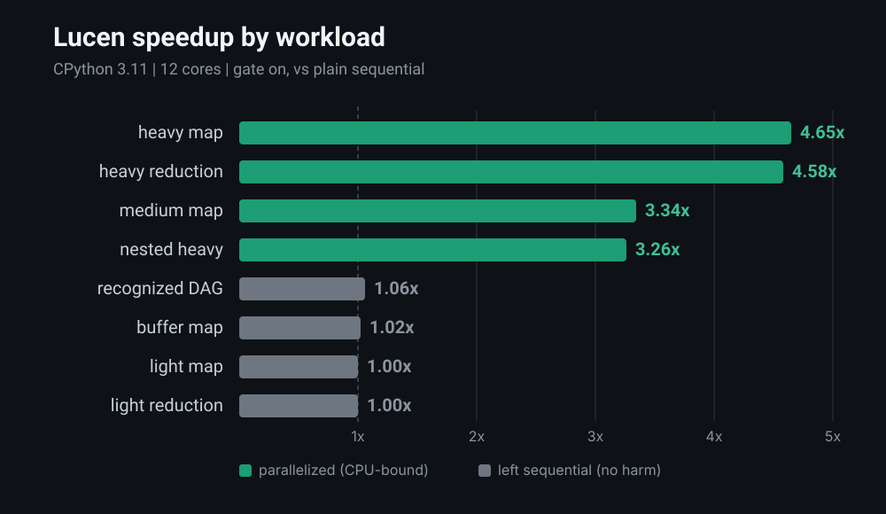

# Lucen

[](https://pypi.org/project/lucen/)
[](#supported-interpreters)
[](LICENSE)
[](https://github.com/fcmv/lucen/actions/workflows/ci.yml)
[](https://securityscorecards.dev/viewer/?uri=github.com/fcmv/lucen)

**Never an incorrect result. Never disruptive. Never silently pointless.**

Lucen is a source-to-source compiler that parallelizes ordinary Python loops
marked with a pair of comment pragmas. It rewrites a marked loop into chunked
parallel execution only when it can prove the result will be identical to
running the loop sequentially; anything it cannot prove runs as the Python you
wrote.

[Documentation](https://fcmv.github.io/lucen/) |
[Changelog](CHANGELOG.md) |
[Questions and bug reports](SUPPORT.md)


```python
# LUCEN START
for i in range(len(records)):
    scores[i] = score(records[i])
# LUCEN END
```

```bash
lucen run work.py
```

Over 100,000 records that loop goes from 5.7 s to 2.3 s on twelve cores, with
a bit-identical checksum ([examples/scored_records.py](examples/scored_records.py),
median of 3). The pragmas are ordinary comments, so with Lucen uninstalled the
file is the program you started with: the
[Comment Invariant](docs/glossary.md).

## Guarantees

1. **Never an incorrect result.** Chunks write private slabs, audited for
   disjointness at join and committed in chunk order. Dict insertion order,
   float reduction bits and mid-error container state all match sequential
   execution, bit for bit. A write conflict discards the parallel attempt and
   re-runs the loop sequentially.
2. **Never disruptive.** Whatever cannot be proven runs sequentially, with the
   reason recorded in `lucen.get_fallback_report()`. Exceptions keep their type,
   their message and the exact sequential-prefix state of your containers.
3. **Never silently pointless.** A static pre-screen and a runtime probe refuse
   to parallelize loops that would lose to dispatch overhead, and say so.

These hold across a matrix of 7 interpreters x 8 workloads x 4 execution
pathways, every cell checked bit-identical against plain Python
([BENCHMARK.md](BENCHMARK.md)). What they assume about your own code is
[LIMITATIONS.md](LIMITATIONS.md) section 1.

## Installation

```bash
pip install lucen
```

Requires Python 3.9 or later. There are no third-party runtime dependencies on
3.11 and later; 3.9 and 3.10 need `tomli` to read `lucen.toml`. On GIL builds
pip installs a native Rust core (abi3, one binary per platform) that runs the
write-set audit and the reduction folds. On free-threaded builds, where the
abi3 core cannot load, pip installs the pure-Python wheel instead, which passes
the same test suite.

From source, with the optional Rust toolchain:

```bash
git clone https://github.com/fcmv/lucen
cd lucen
pip install -e ".[dev]"
pytest
```

### Supported interpreters

| Interpreter | Status | Native core |
|---|---|---|
| CPython 3.9 to 3.14, GIL | Gated in CI on Linux, macOS and Windows | yes |
| CPython 3.14t, free-threaded | Gated in CI | pure-Python fallback |
| PyPy 3.11 | Gated in CI | pure-Python fallback |
| GraalPy 24.1 | Best effort, not gated | pure-Python fallback |

3.13t takes the same pure-Python path as 3.14t and is not gated separately.

## Usage

For a script you launch directly, use `lucen run`. It rewrites the marked loops
in that file, then executes it:

```bash
lucen run work.py
```

Plain `python work.py` cannot parallelize a loop in the entry script: by the
time anything of Lucen's runs, that module is already compiled. For an
application you start yourself, install the import hook before the module
holding the marked loop is imported:

```python
import lucen
lucen.activate()

import work
work.main()
```

On Windows and macOS the process backend re-imports the entry module in every
worker, so it needs the usual `if __name__ == "__main__":` guard. Lucen detects
a missing guard before any worker spawns and runs the block sequentially with a
message naming the fix. `activate()` is idempotent.

## Reports

`lucen explain` reports each block's classification without running the file:

```
$ lucen explain examples/demo_workload.py
examples/demo_workload.py: 2 marked block(s) [gil interpreter assumed]

Block 1 (line 14)
  + Parallelized
  Backend: PROCESS, flat chunk scheduler
  Reason: all shared writes are provably or assertedly disjoint per iteration
  Clauses in effect: calibrate=false
  Runtime-dependent (never reported statically): argument picklability,
  custom-callable well-formedness, pool availability - see `lucen profile`.
```

A block it refuses names the reason:

```
Block 1 (line 12)
  - Sequential
  Reason: cross-iteration dependency 'scores[i - 1]' (monotonic chain)
```

`lucen profile script.py --per-block` reports what actually ran, with timings.
A runtime downgrade prints one line on stderr and is retained as a structured
record:

```
lucen fallback: PARALLEL_UNPROFITABLE (work.py:4): measured ~44 ns/iteration
loses to dispatch overhead; ran SEQUENTIAL (calibrate=false overrides, spec 5.17)
```

```python
for record in lucen.get_fallback_report():
    print(record.error, record.file, record.line, record.message)
```

In CI, `lucen explain --strict --baseline baseline.json` fails the build when a
block's classification regresses against a committed baseline.

## Tuning

Clauses go on the `# LUCEN START` line. Each one trades a Lucen-held proof for
an assertion of yours, or exactness for speed, never a different answer. A
malformed clause is a loud import-time error with a did-you-mean suggestion.

```python
# LUCEN START calibrate=false, timeout=5.0, on_error=collect
```

| Clause | What it does |
|---|---|
| `backend=` | Pin the backend: `thread`, `process`, `sequential`, with `pool_size`/`chunks` |
| `calibrate=` | Control the profitability gate (`false` forces parallel) |
| `reduce=` | Name the reduction op (`sum`, `min`, ...) or `custom(fn=, identity=)` |
| `timeout=` | Bound wall time; raises `ParallelTimeoutError` |
| `on_error=` | Gather per-iteration exceptions instead of failing fast (`collect`) |
| `strict=` | Turn this block's fallbacks into hard errors |

Nine more clauses cover CPU affinity, nested blocks, wavefront grain size,
reduction order, progress, fallback surfacing, and the expert assertions that
waive a proof (`depend`, `skip_runtime_check`, `trust`). A third pragma,
`# LUCEN TRUST` above a helper's `def`, asserts that helper is safe under
parallelism. [docs/pragmas.md](docs/pragmas.md) is the full reference: every
accepted form, the `lucen.toml` schema for project-wide defaults and ceilings,
and the opt-in experimental features.

## How it works

```
scanner -> rewriter -> selector -> codegen -> dispatch
(pragmas)  (classify)  (route)     (twins)    (execute + audit + commit)
```

Codegen emits two functions per block: a chunk function for workers, and a
sequential twin that is also the fallback path, so the sequential behavior is
the original loop by construction. Dispatch runs chunks over persistent pools,
audits write disjointness at join, folds reductions in exact element order, and
commits in chunk order. The loop bodies stay your Python; compiling eligible
bodies to native kernels is [ROADMAP](ROADMAP.md) L1.

[docs/architecture.md](docs/architecture.md) has the stage diagrams, the
dependency shapes the analyzer recognizes, and the backend-selection rules. The
[technical specification](docs/spec/lucen_technical_spec.md) is the authority on
every semantic, and the audit and wavefront protocols are
[model-checked](docs/formal/).

## Performance

Medians of 5 after warm-up on a 12-core i5-12450HX, across seven interpreters.
"Native Python" is the identical file with the pragmas as comments; "Lucen" is
the shipped product with its gate deciding.



| Workload | Native Python (ms) | Lucen, gate on (ms) | Best hand-written (ms) |
|---|---|---|---|
| light map (1M) | 67.7 to 93.3 | 32.1 to 50.4 | 48.8 |
| medium map (40k) | 102.9 to 138.1 | 30.1 to 44.0 | 24.1 |
| heavy map (20k) | 1028.8 to 1258.0 | 282.5 to 401.1 | 244.0 |
| light reduction (1M) | 54.1 to 77.6 | 29.4 to 35.8 | 27.6 |
| heavy reduction (20k) | 1028.0 to 1273.0 | 284.4 to 412.2 | 243.2 |
| recognized DAG (100k) | 10.4 to 14.4 | 6.6 to 9.2 | 7.8 |
| buffer map (1M, array) | 75.9 to 106.3 | 52.8 to 67.1 | 26.6 |
| nested heavy (4k) | 61.6 to 79.0 | 16.6 to 27.4 | 13.7 |

Where parallelism pays, Lucen runs 3x to 4.3x faster than its own sequential
execution and lands within a few percent of hand-tuned `concurrent.futures`
code. Where it cannot pay, the gate stays sequential at effectively zero
overhead.

One caveat on the last column: the hand-written comparison code was
AI-generated to an expert standard, and its parallel float reductions produce
different bits than sequential Python on every interpreter tested. Lucen's
reductions are bit-identical everywhere.

The full timing matrix, the correctness matrix, and the raw JSON:
[BENCHMARK.md](BENCHMARK.md).

## Limitations

- **Helper purity is proven only where the source is readable.** A stateful C
  extension or dynamically dispatched callable keeps the documented trust and
  can diverge per worker.
- **`typed_buffers` is not in the cost model.** Array-output maps route
  sequential unless you force `backend=process` with the flag on.
- **Light reductions carry a 5 to 10 percent probe overhead**, because
  reductions cannot use the twin-probe fast path yet.
- **The recognized-DAG wavefront runs sequentially by default.** Its parallel
  form pays off only on free-threaded builds under `backend=thread`.
- **No native core on free-threaded builds**; the pure-Python fallback covers
  them.
- **One loop or comprehension per pragma pair**, no `async` bodies, and
  generator expressions are never parallelized.

The full inventory, and the red-team findings behind the trust boundary, is
[LIMITATIONS.md](LIMITATIONS.md). Planned work against each item is
[ROADMAP.md](ROADMAP.md).

## Documentation

Everything is on the [documentation site](https://fcmv.github.io/lucen/): the
[pragma and clause reference](https://fcmv.github.io/lucen/pragmas/), the
[architecture](https://fcmv.github.io/lucen/architecture/), the
[technical specification](https://fcmv.github.io/lucen/spec/lucen_technical_spec/)
that is the authority on every semantic, the
[API reference](https://fcmv.github.io/lucen/api/), the
[glossary](https://fcmv.github.io/lucen/glossary/), the
[paper](https://fcmv.github.io/lucen/paper/lucen/), the architecture decision
records, and the TLA+ models. [examples/](examples/) is runnable, including the
specification's own worked DAG.

[STABILITY.md](STABILITY.md) states what is covered by semantic versioning: the
pragma grammar, the clause vocabulary, the `lucen.toml` schema, the public API
and the CLI contract are stable; routing decisions, generated code and report
wording are not.

## Getting help

Ask usage questions in GitHub Discussions and file reproducible bugs as GitHub
issues; [SUPPORT.md](SUPPORT.md) has the details. Before either, `lucen explain`
and `lucen profile` answer most "why did this block not parallelize" questions
on their own. Security issues go to [SECURITY.md](SECURITY.md), not public
issues.

## Contributing

Start with `pip install -e ".[dev]" && pytest`. Changes to the execution
pipeline are judged by the invariant suite, and no routing change lands without
benchmark evidence: [CONTRIBUTING.md](CONTRIBUTING.md) has the bar and the
process, and [AI_USAGE_GUIDELINE_FOR_PR.md](AI_USAGE_GUIDELINE_FOR_PR.md) the
policy on AI-assisted contributions. Decisions are made as described in
[GOVERNANCE.md](GOVERNANCE.md), and [CODE_OF_CONDUCT.md](CODE_OF_CONDUCT.md)
governs all project spaces.

## License

Apache-2.0. See [LICENSE](LICENSE).
