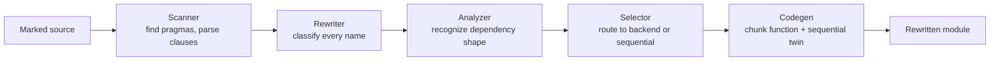
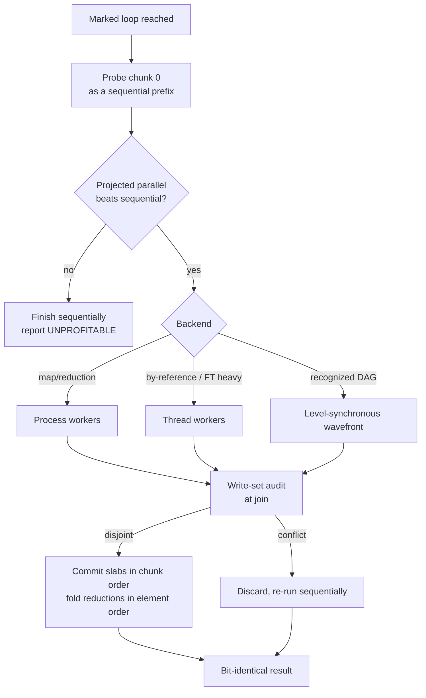

# Architecture

Lucen is a single pipeline from a comment pragma to parallel execution. This
page is the map; the [engineering guide](implementation/lucen_engineering_doc.md)
walks the code, and the [technical specification](spec/lucen_technical_spec.md)
is the authority on every semantic.

## The compile-time pipeline

Activation installs an import hook. When a marked module is imported, the hook
runs it through five stages, each producing a written decision record before the
next begins.

The rewriter classifies each name in the block as loop-local, read-only,
reduction accumulator, indexed write, or cross-iteration read. The analyzer
recognizes dependency shapes analytically (self-contained, monotonic offset,
recognized DAG). The selector routes each block, and codegen emits two functions
per block: a chunk function for workers and a sequential twin that is also the
fallback path, so the sequential behavior is the original loop by construction.

## The runtime dispatch flow

At call time, dispatch decides whether parallelism pays, runs chunks over a
persistent pool, and commits their results in order under an audit.

Every path ends at a result bit-identical to sequential Python. A conflict, a
serialization failure, or anything unprovable discards the parallel attempt and
re-runs the block as the sequential twin; the two concurrency protocols behind
the audit and the wavefront are [model-checked](formal/README.md).

## Backend selection

Selection is static and interpreter-independent. Maps and reductions run on the
process backend on both locked and free-threaded builds, because shared-object
reference counting makes threads lose on shared-container workloads even without
a global lock (ADR 0013). The thread backend serves by-reference blocks and
free-threaded heavy compute; the recognized-DAG wavefront runs sequentially by
default and in parallel only under an explicit `backend=thread` on a
free-threaded build.

## The optional native core

Two orchestration loops, the write-set audit and the reduction fold, run in a
Rust core when the compiled extension is present. Every native operation has an
identical-semantics pure-Python twin, so the library is correct with the
extension absent, and the two paths are proven to agree.
